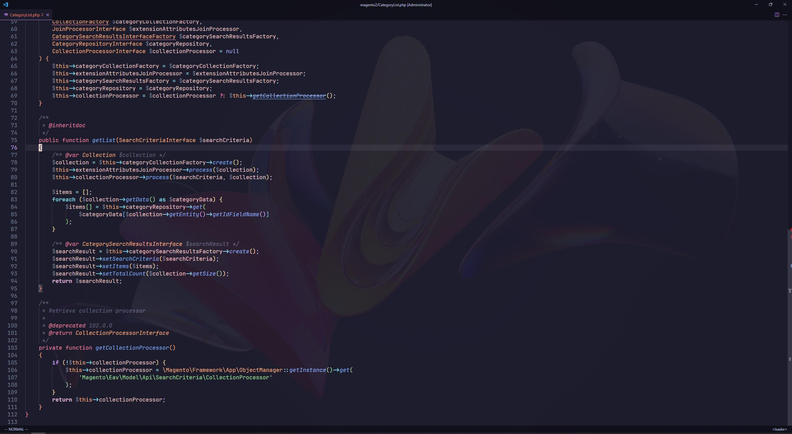

This repository contains my personal config for vscode inspired by neovim.

## Keyboard shortcuts:
- `<leader>e` - Toggle sidebar with files
- `shift + l/h` - Switch tab left/right
- `ctrl + l/h` - Move tab left/right
- `<leader>gd` - Go to definition
- `<leader>vr` - Go to references
- `<leader>vh` - Hover
- `<leader>vc` - Open context menu
- `<leader>pf` - Search for files
- `<leader>pff` - Search for files with filters
- `<leader>ps` - Search for text
- `<leader>psf` - Search for text with filters
- `<leader>d` - Delete with void registry
- `<leader>p` - Paste with void registry
- `<leader>q` - Close buffer

### Explorer:
- `r` - rename file
- `d` - remove file
- `c` - copy file
- `p` - paste file
- `y` - copy relative file path  

## Extensions:
- [`Vim`](https://marketplace.visualstudio.com/items?itemName=vscodevim.vim)
- [`Catppuccin` (Theme)](https://marketplace.visualstudio.com/items?itemName=Catppuccin.catppuccin-vsc)
- [`FintItFaster` (Better search tool)](https://marketplace.visualstudio.com/items?itemName=TomRijndorp.find-it-faster)
    - Requirements:
        - [`fzf` ("command-line fuzzy finder")](https://github.com/junegunn/fzf)
        - [`rg` ("ripgrep")](https://github.com/BurntSushi/ripgrep)
        - [`bat` ("a cat clone with wings")](https://github.com/sharkdp/bat)
- [`GlassIt` (Provides a transparent background)](https://marketplace.visualstudio.com/items?itemName=s-nlf-fh.glassit)
- [`NERDTree` (Basic functions to manage files explorer)](https://marketplace.visualstudio.com/items?itemName=Llam4u.nerdtree)

